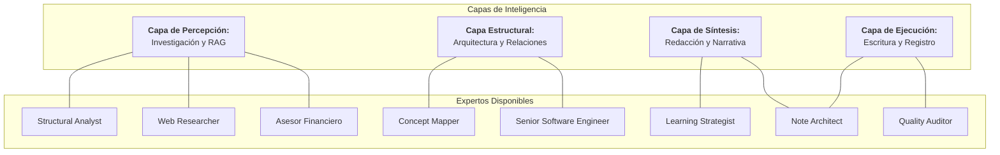
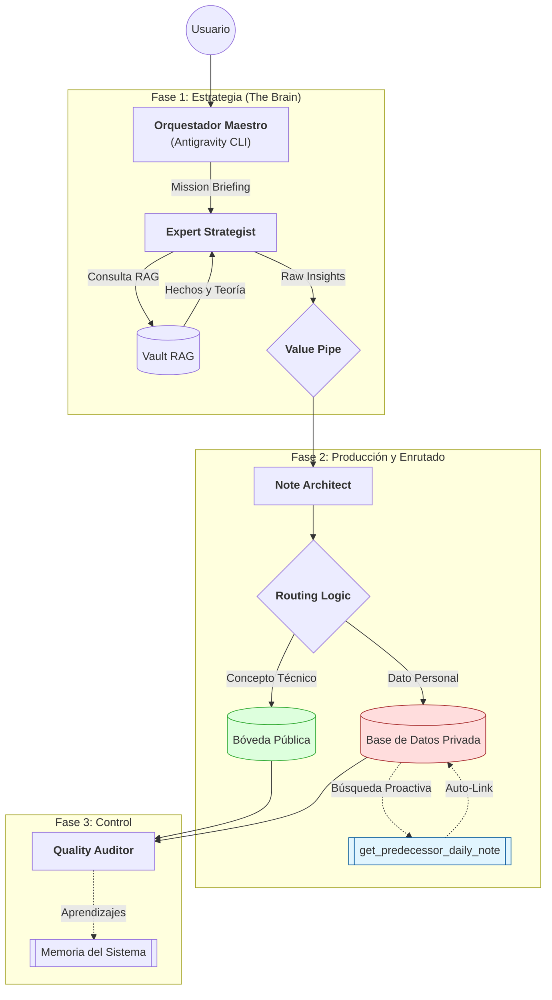

# Arquitectura de Agentes: Ecosistema Modular Vault-Crew (v2 - Diseño en Curso)

Este documento define la infraestructura modular y los flujos de inteligencia para la gestión de la Bóveda.

## 1. Mapa de Capacidades (Pool de Expertos)

---

## 2. Flujo de Trabajo Maestro (The Value Pipeline)

---

## 3. Estrategia de Almacenamiento Atómico

| Tipo de Info | Destino | Formato | Conectividad Temporal |
| :--- | :--- | :--- | :--- |
| **Conocimiento** | Raíz `/` | Nota Atómica (.md) | Wikilinks conceptuales |
| **Hechos personales**| `/Private` | Registro Maestro | Categorización por dominio |
| **Diario** | `/Private/Diario`| YYYY-MM-DD.md | **Auto-link al último día** |

---

## 4. Matriz de Herramientas (Skills)

| Agente | Herramienta | Función |
| :--- | :--- | :--- |
| **Strategist** | `VaultRAGTool` | Búsqueda semántica en PDFs y Notas. |
| **Architect** | `FileWriterTool`| Escritura física forzada (Raíz/Private). |

---

## 5. Estado de Implementación
- [x] Motor RAG Atómico (Ollama).
- [x] Fábrica Modular de Crews.
- [x] Skill de Escritura Directa (FileWriterTool).
- [x] Enrutado de Privacidad (Public vs Private).
